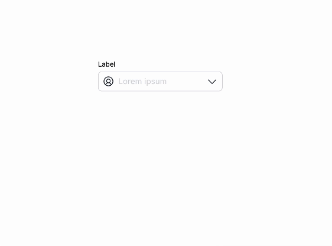

# React Dropdown

<!-- insert gif  -->


### Usage

```jsx
import Dropdown from "./components/Dropdown";
import { useState } from "react";

function App() {
  const [selected, setSelected] = useState<number | undefined>(undefined);

  return (
    <Dropdown
      label="Favourite Fruit"
      onSelect={(index) => setSelected(index)}
      selectedIndex={selected}
      placeholder="Select an option"
      clearable
      options={[
        "Apple",
        "Banana",
        "Cherry",
        "Grape",
        "Kiwi",
        "Orange",
        "Pineapple",
        "Strawberry",
        "Watermelon",
      ]}
    />
  );
}
```


### Storybook

```bash
pnpm storybook
```

### Setup Instructions

```bash
pnpm install
pnpm start
```